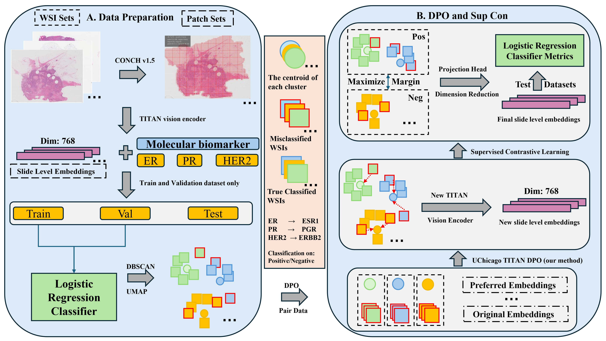

**Overview**

Foundation models like TITAN produce suboptimal embeddings for specialized clinical tasks such as breast cancer biomarker prediction. We propose a hierarchical refinement framework sequentially applying Direct Preference Optimization (DPO) and Supervised Contrastive Learning (SupCon) to enhance discriminative power. DPO adapts preference-based alignment to vision models through self-supervised construction of correction targets from misclassified samples, while SupCon leverages supervised labels to maximize class separability. Evaluated on TCGA-BRCA, our parameter-efficient approach achieves substantial improvements across balanced accuracy, Cohen's $\kappa$, and AUROC metrics, demonstrating effective adaptation of foundation models for molecular biomarker classification in precision oncology.

We basically used the same enviroment as the [TITAN](https://github.com/mahmoodlab/TITAN), you can follow the same package installation instruction.

or

you can:

```
conda create -n titan python=3.9 -y
conda activate titan
pip install -r requirements.txt
```


**Pipeline**




We begin by using the CONCH model to obtain patch-level embeddings for each WSI (Whole Slide Image). Next, we use the TITAN vision encoder to generate slide-level embeddings. These embeddings are then fed into a logistic regression model.
It's important to note that we only use the train and validation datasets for this process. After performing logistic regression, we evaluate the results on the validation set and then apply unsupervised clustering.
Based on the classification results from the logistic regression, we construct our DPO dataset to conduct training with DPO. Finally, we train a Supervised Contrastive Learning (SCL) project head. The goal of this is to increase the distance between clusters while simultaneously decreasing the distance within each cluster, helping to refine the overall structure of the embeddings.
So that’s the whole picture of our project, and next I will introduce Joe to talk about our findings

**Result**


